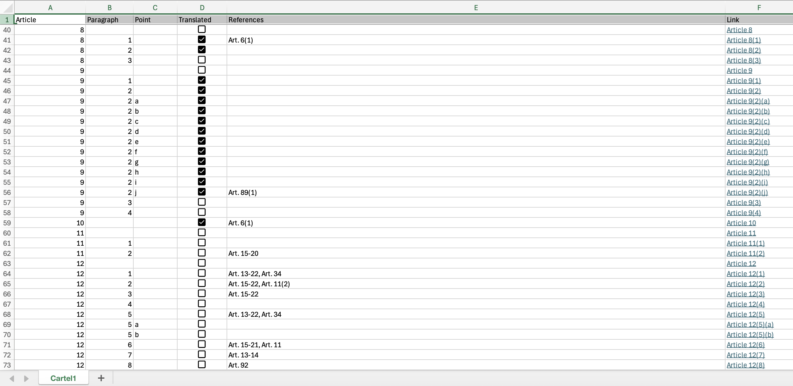

# GDPR_navigator_2
 
This repository is a modified version of [GDPR_navigator](https://github.com/filvan/GDPR_navigator) and is related with [PrivGuard](https://github.com/filvan/PrivGuard).

This repository was created to represent most of the GDPR articles (90 out of 99) as a directed graph.

## Repository structure

- **GDPR_map**, an Excel file listing the GDPR articles, together with some useful info about them
- **Screenshot.png**, a screenshot of a portion of GDPR_map.xlsx
- **main.py**, a Python file containing the source code
- **matrix.txt**, a txt file resulting from the set up of the adjacency matrix that represents the graph 
- **README.md**, this Markdown file

## GDPR_map

This file "map" the GDPR corpus on a single sheet (_Cartel1_) with 794 rows and 6 columns.

In the first row of the file, we have the headers of the columns:
- _Article_
- _Paragraph_
- _Point_
- _Translated_
- _References_
- _Link_

Then we have a row for each _LegalText_ in the GDPR corpus, i.e. either an article interpreted "as a whole" or an article's paragraph or even a single point.
As you can see in the image, some articles have several paragraphs and subparagraphs (e.g. Article 9 and Article 12), others, like Article 10, don't have subsections at all.

The first three columns (_Article_, _Paragraph_ and _Point_) identify a specific _LegalText_.

_Translated_ is a checkbox column that shows whether a _LegalText_ has been translated into _Legalease_ or not.

A _LegalText_ can refer to other _LegalText_. These references can be more or less "precise".
For example, as you can see in the image, Article 8(1) refers to the first paragraph of Article 6.
On the other hand, even if Article 92 contains several subsections, Article 12 doesn't refer to a specific paragraph of it, and that is why we have a vaguer reference in cell 73E.
Sometimes, a _LegalText_ can refer to a list of articles that deal with a common subject. For instance, you can see that Article 12(2) and Article 12(3) refer to the interval spanning from Article 15 to Article 22.

Finally, as its name suggests, the _Link_ column contains links to the Internet.
For each _LegalText_ you can land on the corresponding webpage on https://gdpr-info.eu/ to read its official content.
If you click on a _LegalText_ associated with a (sub)paragraph of an article, the corresponding section will be highlighted on your web browser.

## Codebase

### Cycles' detection and cycles' counting
Currently, the main goal of _main.py_ is to set up an adjacency matrix for the directed graph and to verify whether the graph contains cycles between different _LegalText_ or not.
The file contains several functions, but I will focus on the most important ones to reach this goal.

At first, the **main** function creates some Python dictionaries and import the content of GDPR_map.xlsx in a `pandas` dataframe.
This datastructure is very similar to the table in the Excel file and it can be easily managed by using the functions provided by the `pandas` library.
To keep the links in the dataframe as in the Excel file, I wrote a **setup_links** subroutine that works on them by using the `openpyxl` library.
Since I didn't want NaN values in the table, I removed them by writing `df.fillna('', inplace=True)`.

Then, I initialized the Python dictionaries mentioned above. These datastructures are "compact" versions of the entire 793x6 dataframe and have a very quick access time.
The **setup_dictionaries** function scans the entire dataframe row by row and builds the more or less complex dictionaries accordingly.
- `index2references` contains the row number (also known as index) as key and the list of the references as value.
- `index2article_with_references` is similar to the previous one, but contains a LegalText object as value.
An instance of the LegalText class (which is defined at the beginning of _main.py_) has a string (_name_), a boolean (_translated_) and a list of references (_references_) as attributes.
- `article2index` is useful to do a "reverse lookup", because it contains an article name as key and the corresponding index as value.
- `article2references` contains an article name as key and the corresponding references list as value.

The next step was setting up the adjacency matrix.

### Visualization

In order to display the adjacency matrix as a directed graph, I had to import `NetworkX` to create the nodes and edges and also import `matplotlib` to be able to display the graph.
In order to work with these packages and be able to view the graph you can follow the download instructions from NetworkX for your machine here: https://networkx.org/documentation/stable/install.html.
You can also follow the download instructions for matplotlib for your machine here: https://matplotlib.org/stable/install/index.html.
Once downloaded and running the code, the directed graph will appear in a new window.
The home button on the new window is to reset the view, the arrows are to toggle different views you have activated before, the axis button to move around the graph, the magnifying glass is a zoom-in button in which you create a square around the area you want to zoom-in on, and finally the save figure to save the figure to your local machine.

## Credits

Many thanks to [Esteban Garcia Taquez](https://github.com/Esgartaq04), who contributed to this repository by working on GDPR_map and by studying possible ways to print out the graph in main.py.